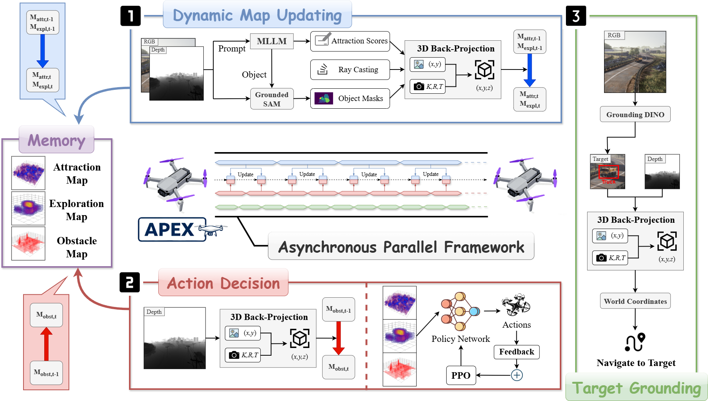

# APEX: A Decoupled Memory-based Explorer for Asynchronous Aerial Object Goal Navigation

## Abstract
Aerial Object Goal Navigation, a challenging frontier in Embodied AI, requires an Unmanned Aerial Vehicle (UAV) agent to autonomously explore, reason, and identify a specific target using only visual perception and language description. However, existing methods struggle with the memorization of complex spatial representations in aerial environments, reliable and interpretable action decision-making, and inefficient exploration and information gathering. To address these challenges, we introduce **APEX** (Aerial Parallel Explorer), a novel hierarchical agent designed for efficient exploration and target acquisition in complex aerial settings. APEX is built upon a modular, three-part architecture: 1) Dynamic Spatio-Semantic Mapping Memory, which leverages the zero-shot capability of a Vision-Language Model (VLM) to dynamically construct high-resolution 3D Attraction, Exploration, and Obstacle maps, serving as an interpretable memory mechanism. 2) Action Decision Module, trained with reinforcement learning, which translates this rich spatial understanding into a fine-grained and robust control policy. 3) Target Grounding Module, which employs an open-vocabulary detector to achieve definitive and generalizable target identification. All these components are integrated into a hierarchical, asynchronous, and parallel framework, effectively bypassing the VLM's inference latency and boosting the agent's proactivity in exploration. Extensive experiments show that APEX outperforms the previous state of the art by +4.2\% SR and +2.8\% SPL on challenging UAV-ON benchmarks, demonstrating its superior efficiency and the effectiveness of its hierarchical asynchronous design. Our source code is provided in https://github.com/4amGodvzx/apex.

